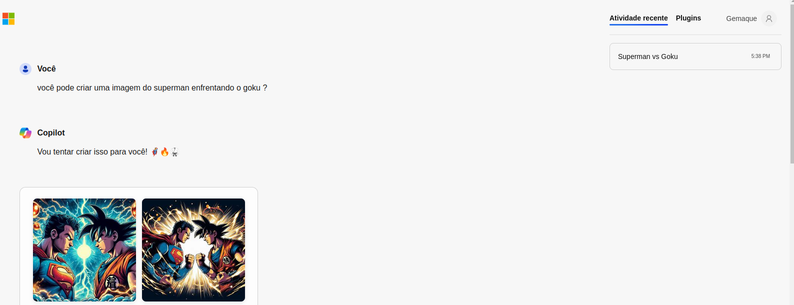

# Explorando os Recursos de IA Generativa com Copilot e OpenAI

### Acesso o portal do copilot:

- ⚡ Acessei o portal do Copilot em https://copilot.microsoft.com/ utilizando minhas credenciais da Microsoft.

* Neste desafio, explorei os recursos de IA generativa oferecidos pela Microsoft Copilot e Azure OpenAI. Aqui está o que você encontrará:

## Estrutura do Repositório

- **inputs:** Pasta contendo o arquivo das sentenças usadas no copilot.
- **output:** Pasta contendo os resultados gerados pelos modelos de IA generativa.

## Processo de Exploração

   - Após o processamento da solicitação, recebi a imagem gerada pelo modelo.
   - Salvei a imagem resultante na pasta 'output'.

A capacidade de gerar imagens a partir de descrições é incrivelmente útil para artistas e designers.

Os resultados gerados podem ser adaptados para atender às preferências individuais dos usuários.

* A importância de fornecer descrições claras e detalhadas para garantir resultados precisos.

